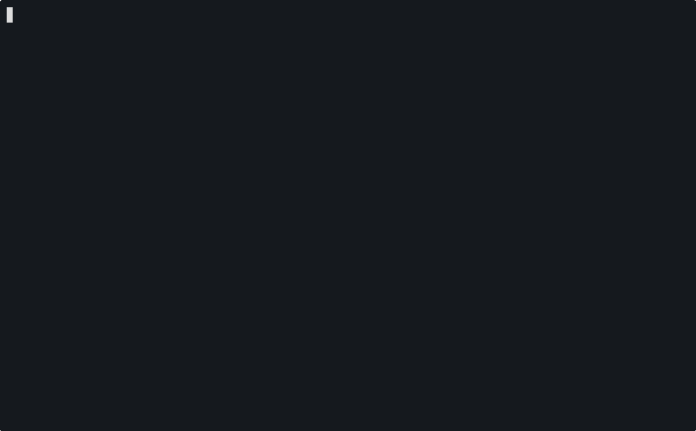

# Langjam Gamejam

The source code for the game is in `game/source.prolog`. It's written in a Prolog-like language whose interpreter lives under `language/`.



```bash
$ mise install
$ cabal run
```
